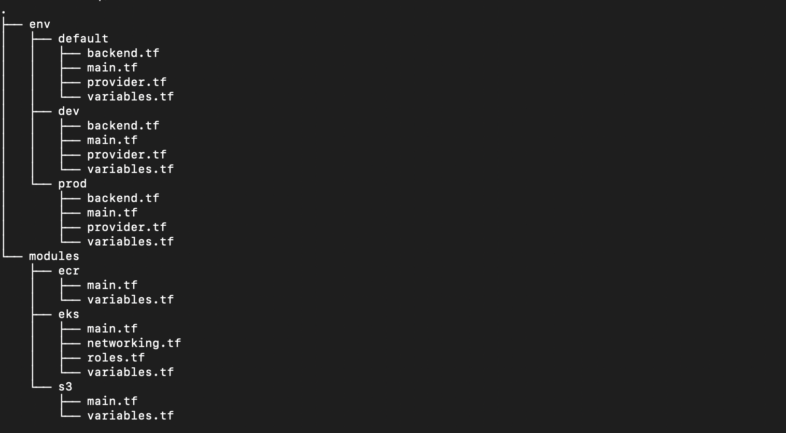

# Introduction -

#### This is a microservices based project that showcases the power and importance of DevOps in management of applications to ensure high availability and scalability with zero downtime. This project manages two environments ( dev and prod ) for now. It can easily scale to support as many environment as needed with a little tweak.

# System Architecture -

# Features -

- Docker images are ~80% small in size using best practices.
- Highly available prod env with containers scheduled in 2 AZs and can scale as per requirement.
- Dev env is only in one AZ and no scalability ( can be modified if needed ).
- CI / CD pipelines for managing multiple enviroments for each microservice.
- custom pipeline trigger points for appropriate use case as per environment.
- Helm charts for managing kubernetes workload.
- The secrets are safely stored in GITHUB SECRETS.
- The entire Infrastructure required for the application is provisioned using Terraform on AWS.
- The Terraform uses s3 backed to persist tfstate file.

# Infrastructure  -
- The entire Infrastructure for this project is provisioned and managed using terrafrom and its best practices on AWS.
- the resources provisioned are as follows:
    - Elastic Container Registry (ECR)
    - Elastic Kubernetes Services (EKS) 
        - 2 Node groups for dev and prod environment ( dev node group contains 1 node & prod containes 2 nodes)
        - IAM roles and policies for cluster and nodes.
        - 1 vpc
        - 3 subnets ( 1 for dev & 2 for prod in seperate AZ )
        - Internet gateway
        - route table
- terraform backend is stored remotely on a s3 bucket for safety and remote access.
- the pipeline "infra.yml" is responsible for infrastructure deployment.
- the following tree structure shows well organised and easy to scale infrastructure management.
    

# CI/CD Architecture -

# kubernetes manifests for microservices - 

- each microservice is managed by seperate helm chart in the helm folder.
- each microservice has two values file for each environment.
- values-dev.yaml deploys resources in the dev nodegroups with label dev to keep it sepearate from the prod nodes.
- values-prod.yaml deploys resources in the prod nodegroup with label prod.
- the cicd manages the seperation of namespaces for the env.
- horizontal pod autoscaling is enabled to scale as per requirement.

# Pre-requisites for setup - 

- configure s3 bucket for terraform backend
- store github secrets
- once the infrastructure is deployed, do following in the eks cluster:
    - create namespaces ( dev & prod )
    - install nginx-ingress-controller
    - install metrics-server

# Development Instructions
- [Development Instructions](development-readme.md)